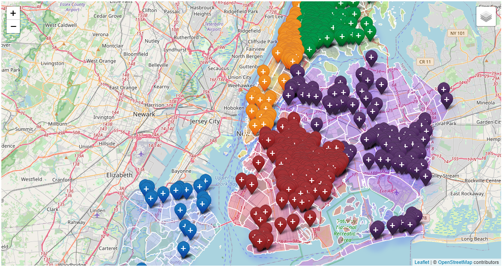

# NYPD shooting incidents interactive web visualization.

## Project Directive
Retrieve public 2019 NYPD shooting incident data, and parse through json data using JavaScript and display an interactive webpage on GitHub Pages.

## Dataset
https://catalog.data.gov/dataset/nypd-shooting-incident-data-historic

## Charts

## Deployment
https://colinfoneill.github.io/NYPD_Shooting_Incidents_Viz/

Navigate through the webpage to visualize the heatmap of shooting incident locations, as well as the bar chart and pie chart to view distributions of variables of interest for the collection of shooting incidents.

